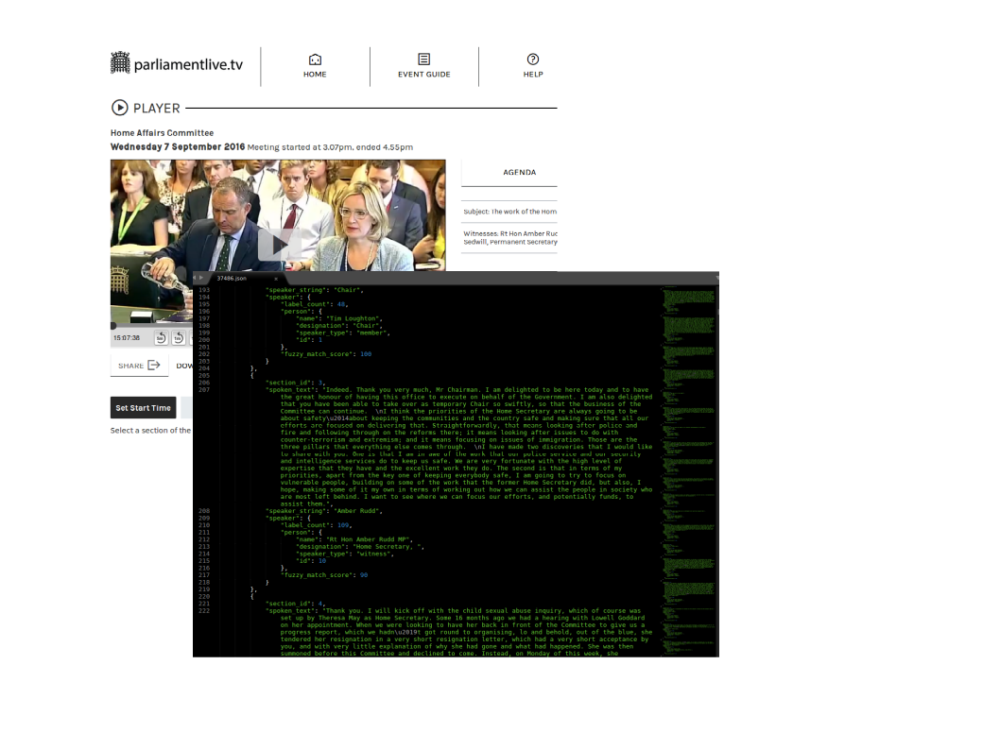
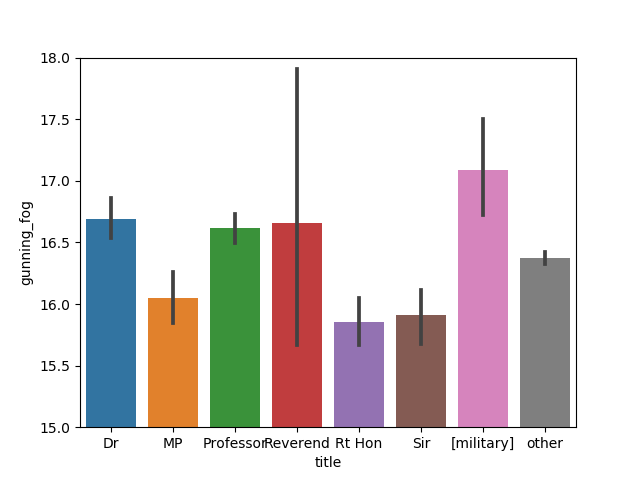

# parliament-text
_**Download and analyse text from UK Parliamentary committee evidence transcripts**_

I started this project to create a source for practicing NLP techniques on spoken language across a wide range of topics and speakers.

### Acknowledgements

Thanks to the parliament website team for making the transcripts documents available online.

To the many great NLP libraries that made this project possible. [TODO: add requirements.txt list of key packages]

## Introduction

This project attempts to captures the text from committee transcripts into a structured format to facilitate comparison between hearings and speakers.

For an introduction to the work of the committees see [here](https://www.parliament.uk/business/committees/).

The downloads contain Parliamentary information licensed under the [Open Parliament Licence v3.0](https://www.parliament.uk/site-information/copyright-parliament/open-parliament-licence/).

## Analysis Example

Here's a chart showing the distribution of [Gunning Fog](https://en.wikipedia.org/wiki/Gunning_fog_index) readability values across all the speakers captured. The speakers are grouped according to certain honorific titles. Most speakers have no such title (shown as 'other').

