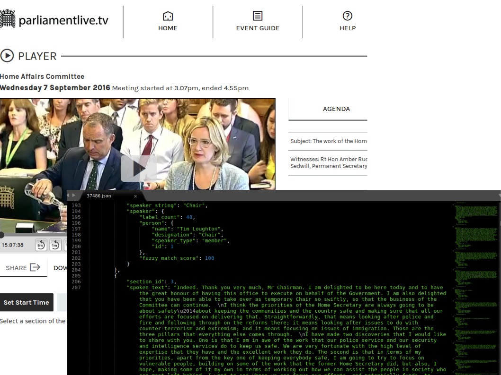

# parliament-text
_**Download and analyse text from UK Parliamentary committee evidence transcripts**_




#### Project goals

* Get new data for practicing NLP techniques
* Access a new high-quality text data source
    * spoken English
    * diverse speakers and topics: professional, political and personal
    * professional transcripts
* Capture key metadata
    * committee inquiries
    * names of public figures


#### Project status: early days...

* **Downloading**: Working fairly well: 2290 transcripts downloaded;
handles many of the different
web formats for different inquiries. Need to check how many transcripts
are missing, though.

* **Parsing**: Basic setup working ok in most cases.
Only parsing HTML files, not PDF. (PDF files mostly
duplicate the same text as HTML files.) 9200 witness/session
cases identified. Identifying names and
witnesses' designations and affiliations is the greatest challenge
here. The current version does a reasonable job but there is still
significant inaccurcy which needs to be addressed. The JSON output
file makes it easy to access the text programmatically, there's room
for improvement in the format though.

* **Analysing**: Not much completed here, just a quick demo using
readability analysis - see example chart below.

* **Priorities** The top priority is to improve the named entity
recognition. Help would be very welcome!


#### Background

For an introduction to the work of the committees see [here](https://www.parliament.uk/business/committees/).

The downloads contain Parliamentary information licensed under the [Open Parliament Licence v3.0](https://www.parliament.uk/site-information/copyright-parliament/open-parliament-licence/).

A few newsworthy witnesses and evidence sessions from recent years:

* [**Rt Hon Tony Blair**: Libya intervention inquiry, 2015](http://data.parliament.uk/writtenevidence/committeeevidence.svc/evidencedocument/foreign-affairs-committee/libya-examination-of-intervention-and-collapse-and-the-uks-future-policy-options/oral/25851.html)
* [**Sir Philip Green**: The sale of BHS, 2016](http://data.parliament.uk/writtenevidence/committeeevidence.svc/evidencedocument/business-innovation-and-skills-committee/bhs/oral/34430.html)
* [**Alexander Nix**: Fake News inquiry, 2018](http://data.parliament.uk/writtenevidence/committeeevidence.svc/evidencedocument/digital-culture-media-and-sport-committee/fake-news/oral/79388.html)


### Acknowledgements

Thanks to the Parliament website team for making the transcripts
documents available online.

To the many great NLP libraries that made this project possible,
including `selenium`, `spacy`, `fuzzywuzzy`, `html2text` and `textstat`.


### Usage
Typical usage. This will download all documents, parse them into JSON
storage documents, then run a simple anlaysis of the transcripts'
text.

Run from the project folder:-

```
python parliament-text --storage=/tmp/my_storage_folder --download --parse --analyse
```


#### Analysis Example

Here's a chart showing the distribution of
[Gunning Fog](https://en.wikipedia.org/wiki/Gunning_fog_index)
readability values across all the speakers captured. The speakers are
grouped according to certain honorific titles.
Most speakers have no such title (shown as 'other'). Apparently,
**military witnesses
apparently have the most difficult to understand speech!**

